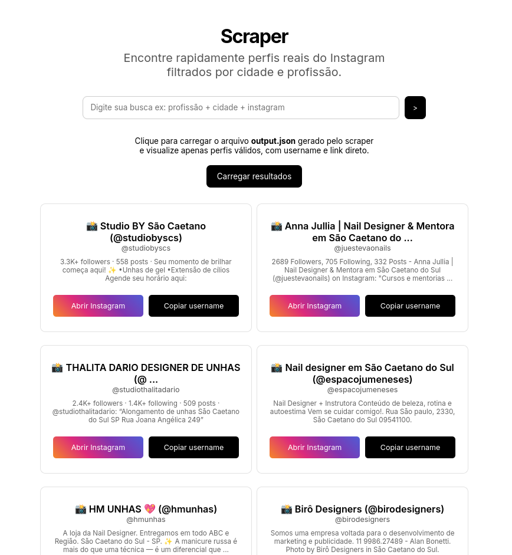

# Prospex — Gerador Automático de Leads Qualificados por IA

**Crawling + Qualificação por IA + Dashboard visual para prospecção de clientes no Instagram**

O Prospex é uma ferramenta completa de prospecção automatizada para freelancers, agências e consultores digitais.

Ele rastreia perfis reais do Instagram via Google, qualifica cada lead com um diagnóstico comercial gerado por IA local e exibe tudo em um dashboard visual — pronto para abordagem.

<p align="center">
  
</p>

---

## Como funciona

O pipeline é dividido em três módulos independentes:

```
crawler → qualifier → dashboard
```

**1. Crawler** — busca no Google simulando um usuário humano real, percorre múltiplas páginas da SERP, filtra apenas perfis do Instagram e salva os leads em JSON e CSV.

**2. Qualifier** — lê os leads coletados e envia cada perfil para um modelo de IA local (via Ollama) que gera um diagnóstico comercial acionável: onde o negócio perde clientes, qual oportunidade existe e qual solução oferecer.

**3. Dashboard** — interface visual que carrega os leads qualificados, exibe o diagnóstico da IA por card, permite abrir o Instagram diretamente e marcar perfis como abordados com persistência local.

---

## O que o Crawler extrai

Para cada perfil encontrado:

- `username` — @ do Instagram
- `title` — nome do perfil
- `link` — URL direta
- `snippet` — descrição indexada pelo Google
- `followers` — número de seguidores (quando disponível)
- `query_origin` — qual busca gerou aquele lead

---

## O que o Qualifier gera

Para cada lead, a IA produz:

- `diagnosis` — como o negócio provavelmente funciona hoje e onde está perdendo clientes
- `opportunity` — qual melhoria prática pode ser feita
- `offer_angle` — qual tipo de solução faz sentido oferecer

O modelo roda 100% local via Ollama — sem custo por chamada, sem dependência de API externa.

---

## Para que serve

Ideal para quem precisa encontrar clientes para serviços como:

- Sites e landing pages
- Branding e identidade visual
- Automações e integrações
- Consultoria digital

Basta ajustar as queries para qualquer nicho e cidade — o pipeline faz o resto.

---

## Comportamento anti-detecção

O crawler usa:

- Chrome real com perfil persistente
- User-Agent humano
- Delays aleatórios entre páginas e queries
- Remoção do `navigator.webdriver`

---

## Performance

- Crawler: ~10 leads por página, múltiplas queries em paralelo
- Qualifier: ~12 segundos por lead com `phi3:mini` rodando local, 4 workers paralelos
- 50 leads qualificados em aproximadamente 10 minutos
